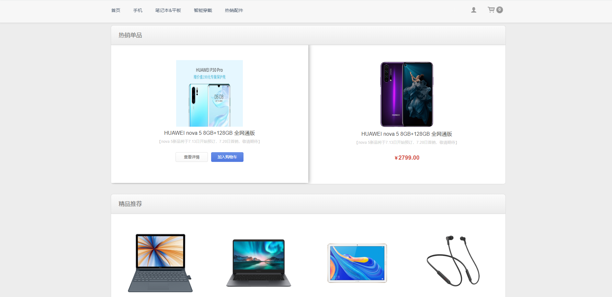

## YMall

## 开发环境

- 操作系统：Windows 10 Enterprise
- 开发工具：Intellij IDEA
- 数据库：MySQL 8.0.13
- Java SDK：Oracle JDK 1.8.152

## 项目管理工具

- 项目构建：Maven
- 代码管理：Git

## 后台主要技术栈

- 核心框架：Spring + Spring MVC + MyBatis
- 数据库连接池：Alibaba Druid
- 数据库缓存：Redis
- 接口文档引擎：Swagger2 RESTful 风格 API 文档生成
- 全文检索引擎：Elasticsearch
- 系统任务调度：Quartz

## 前后分离

- 前端框架：NodeJS + Vue + Axios
- 前端模板：ElementUI

## 项目截图

### YMall 商城前台

- 首页

  

- 分类商品页

- 商品详情页

- 购物车

- 下单

![]/screenhots/下单-1.png)

- 支付

- 会员中心-我的订单

- 会员中心-账号资料

- 会员中心-修改地址

- 注册

- 登录

- 忘记密码

### YMall 商城后台

- 管理员登录

- 首页

- 首页板块管理

- 首页板块内容管理

- 首页轮播图管理

- 商品管理

- 分类管理

- 订单管理

- 管理员管理

- 报表管理

- 快递管理

